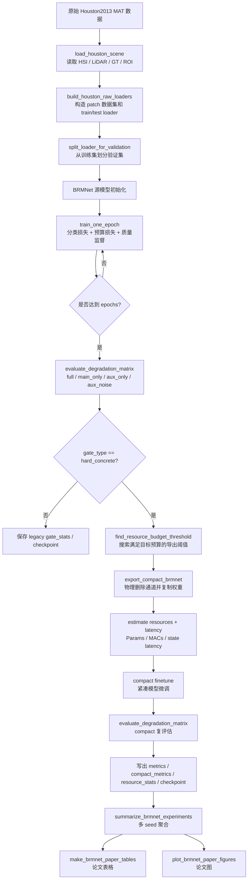
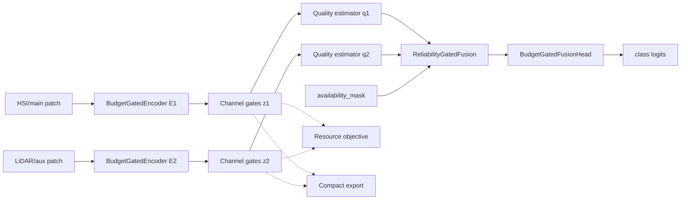
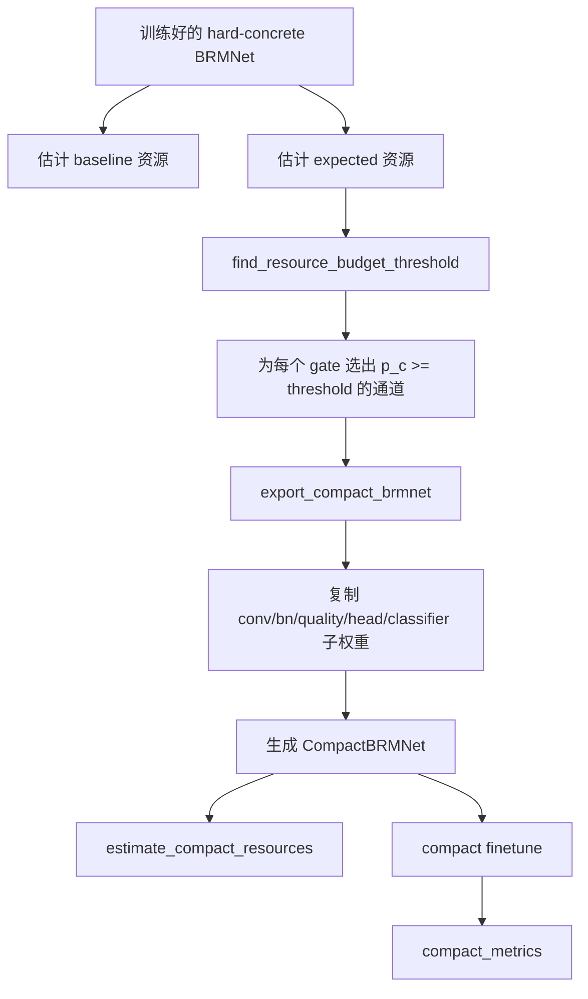
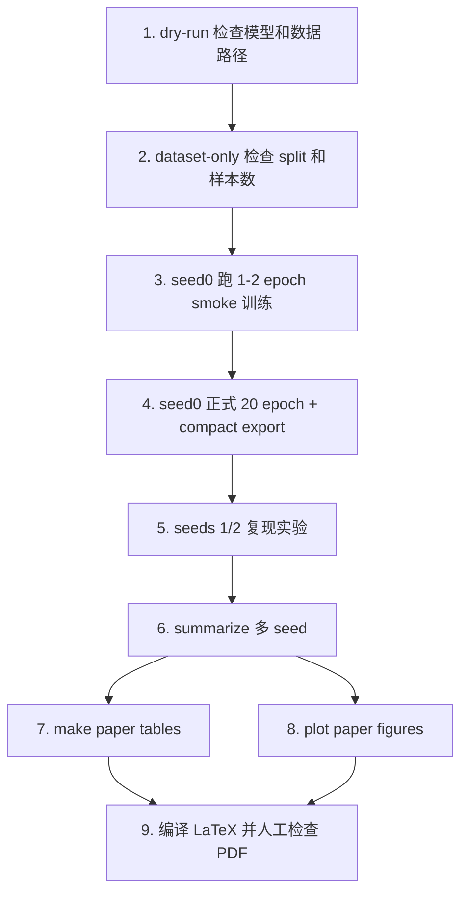

# BRM-Net 当前代码全流程说明

本文档面向当前 `brmnet-core-extraction` 分支，解释可复现实验主线的运行流程、核心原理、关键参数和输出文件。仓库中仍保留了大量历史实验目录，例如 `prune/`、`missing*/`、`src/`、`MCL/` 等；当前建议优先使用 `brmnet_core/` 与 `scripts/` 形成的干净主线。

## 1. 当前推荐主线

当前论文代码主线可以概括为：

> Houston2013 HSI-LiDAR 数据加载 -> BRM-Net 源模型训练 -> 缺失/退化模态评估 -> hard-concrete 结构化门控导出 compact 模型 -> compact 微调 -> 多模态状态复评估 -> 多 seed 汇总 -> 论文表格和图生成。

核心入口如下：

| 目标 | 文件 |
|---|---|
| 单次 Houston2013 实验训练、导出、评估 | `scripts/run_brmnet_houston.py` |
| 批量实验矩阵生成 | `scripts/make_brmnet_experiment_matrix.py` |
| 多 seed 实验汇总 | `scripts/summarize_brmnet_experiments.py` |
| 论文表格生成 | `scripts/make_brmnet_paper_tables.py` |
| 论文总览图生成 | `scripts/plot_brmnet_paper_figures.py` |
| 退化可靠性诊断图/表 | `scripts/analyze_brmnet_degradation_reliability.py` |
| 模型、训练、导出、资源估计核心包 | `brmnet_core/` |

推荐环境：

```powershell
conda activate hslinets
```

当前已记录的可用信息：`hslinets` 环境可使用 CUDA，适合跑 Houston2013 实验和绘图脚本。

## 2. 总体运行流程图



## 3. 数据流程

当前主线的 raw 数据入口只支持 `hsi+lidar`，对应 `brmnet_core/data/houston.py`。

`--data-root` 目录应包含：

| 文件 | MAT key | 含义 |
|---|---|---|
| `2013_IEEE_GRSS_DF_Contest_CASI_349_1905_144.mat` | `ans` | HSI 高光谱图像 |
| `2013_IEEE_GRSS_DF_Contest_LiDAR.mat` | `LiDAR_data` | LiDAR 高程/强度辅助模态 |
| `GRSS2013.mat` | `name` | 全图 GT 标签 |
| `2013_IEEE_GRSS_DF_Contest_Samples_TR.mat` | `TR_Samples` | 官方训练 ROI |

常用数据协议：

| 参数 | 作用 |
|---|---|
| `--data-format raw` | 使用当前 clean 数据入口，推荐 |
| `--data-format legacy` | 调用旧 dataloader，仅用于兼容 |
| `--split-protocol official` | 使用官方训练 ROI，论文主结果优先使用 |
| `--split-protocol random` | 随机像素划分，用于划分敏感性分析 |
| `--split-seed 42` | 随机划分种子 |
| `--split-file path\to\split.npz` | 复用已有划分，避免重新随机 |
| `--patch-size 7` | 每个样本裁剪的空间 patch 尺寸 |

数据构建后，run 目录会写出：

| 文件 | 含义 |
|---|---|
| `split.npz` | 训练/测试坐标和标签 |
| `split_summary.json` | 协议、样本数、类别计数、坐标 hash |
| `normalization.npz` | HSI/LiDAR 标准化统计量 |
| `data_fingerprint.json` | 原始 MAT 文件路径、大小、修改时间和 hash |

## 4. 模型结构原理

当前模型定义在 `brmnet_core/model.py`，核心类为 `BRMNet`。



### 4.1 双分支编码器

`BudgetGatedEncoder` 位于 `brmnet_core/encoders.py`。

默认宽度：

```text
encoder width = (32, 64, 128)
```

每个模态一条分支：

- main 分支：通常是 HSI，输入通道为 144；
- aux 分支：通常是 LiDAR，输入通道为 1；
- 最后一层输出通道使用共享 gate，保证两个分支导出后仍具有相同融合维度。

### 4.2 Hard-concrete 结构化门控

`HardConcreteGate` 位于 `brmnet_core/hard_concrete.py`。

它为每个输出通道学习一个可微门控概率：

```text
p_c = sigmoid(log_alpha_c - stretch_offset)
```

训练阶段可以使用 soft/stochastic gate 近似通道选择；导出阶段根据阈值形成 hard mask：

```text
mask_c = 1[p_c >= threshold]
```

关键点：

- `expected_active_probability()` 用于估计每层期望保留通道；
- `hard_mask(threshold)` 用于导出时选择实际保留通道；
- `set_expected_active_probability()` 用于按目标预算初始化所有 gate；
- `set_hard_concrete_inference_mode(model, "hard")` 用于 hard 推理。

### 4.3 可靠性估计与可用性融合

`ModalityQualityEstimator` 和 `ReliabilityGatedFusion` 位于 `brmnet_core/fusion.py`。

每个模态的质量估计器为：

```text
AdaptiveAvgPool2d -> Flatten -> Linear -> ReLU -> Linear -> Sigmoid
```

输出：

```text
q_main, q_aux in (0, 1)
```

融合时有两种模式：

| 参数 | 含义 |
|---|---|
| `--fusion-mode reliability` | 使用质量分数做 softmax 加权 |
| `--fusion-mode uniform` | 不用质量分数，只对可用模态均匀平均，用作消融 |

可靠性模式下：

```text
weight = softmax(q / temperature)
fused = w_main * feature_main + w_aux * feature_aux
```

如果传入 `availability_mask`，不可用模态会在 softmax 前被置为极小值，因此不会参与融合。

### 4.4 分类头

`BudgetGatedFusionHead` 默认宽度：

```text
head width = (128, 64)
```

结构为两层 gated conv block，加全局池化和线性分类器。

## 5. 训练损失

损失函数位于 `brmnet_core/losses.py`，核心为：

```text
L = L_cls + lambda_budget * L_budget + lambda_quality * L_quality
```

| 项 | 来源 | 含义 |
|---|---|---|
| `L_cls` | `cross_entropy(logits, labels)` | 分类损失 |
| `L_budget` | `resource_budget_loss` 或 legacy gate retention loss | 约束模型资源接近目标预算 |
| `L_quality` | `modality_quality_loss` | 监督质量分数接近质量目标 |

hard-concrete 主线中，预算损失基于期望资源比例：

```text
L_budget = (expected_resource_ratio - target_budget)^2
```

其中 `expected_resource_ratio` 可以是：

- `expected_macs_ratio`
- `expected_params_ratio`

由 `--budget-metric macs|params` 决定。

## 6. 缺失模态与退化模态机制

训练与评估逻辑位于 `brmnet_core/engine.py`。

### 6.1 训练时模态 dropout

参数：

```text
--modality-dropout-prob 0.25
```

含义：每个 batch 中按概率选中样本，并随机丢弃 main 或 aux 其中一个模态。实现会同时：

- 将对应输入置零；
- 将 `availability_mask` 对应位置置 0；
- 将质量监督目标置为 0。

作用：让模型学习 full、main_only、aux_only 等缺失模态状态。

### 6.2 训练时辅助模态退化质量监督

参数：

```text
--lambda-quality 1.0
--aux-quality-degradation-prob 0.25
--aux-quality-degradation-types noise,downsample_4,occlusion_50
```

含义：辅助模态仍然可用，但人为加入退化，并降低其质量目标。当前支持：

| 类型 | 操作 | 默认质量目标 |
|---|---|---:|
| `noise` | 加高斯噪声 | `--aux-quality-degradation-target`，默认 0.5 |
| `downsample_2` | 下采样 2 倍再上采样 | 0.5 |
| `downsample_4` | 下采样 4 倍再上采样 | 0.25 |
| `occlusion_25` | 遮挡顶部 25% 行 | 0.75 |
| `occlusion_50` | 遮挡顶部 50% 行 | 0.5 |

论文当前较合理的主线是轻量多退化设置：

```text
quality_multi_degradation_p025:
  modality_dropout_prob = 0.25
  lambda_quality = 1.0
  aux_quality_degradation_prob = 0.25
  aux_quality_degradation_types = noise,downsample_4,occlusion_50
```

### 6.3 评估矩阵

`evaluate_degradation_matrix()` 默认评估：

| mode | 含义 |
|---|---|
| `full` | HSI + LiDAR 完整输入 |
| `main_only` | 仅 HSI 可用，LiDAR 置零且 mask=0 |
| `aux_only` | 仅 LiDAR 可用，HSI 置零且 mask=0 |
| `aux_noise` | LiDAR 加噪但仍可用 |

扩展诊断中还支持：

| mode | 含义 |
|---|---|
| `aux_noise_low/mid/high` | 不同强度 LiDAR 噪声 |
| `aux_downsample_2/4` | LiDAR 分辨率退化 |
| `aux_occlusion_25/50` | LiDAR 局部遮挡 |

## 7. Compact 导出流程

compact 导出是当前代码区别于 soft mask 论文想法的关键。实现位于：

- `brmnet_core/export.py`
- `brmnet_core/compact.py`
- `brmnet_core/resources.py`
- `scripts/run_brmnet_houston.py::write_structured_pruning_artifacts`



导出时会保存：

| 文件 | 含义 |
|---|---|
| `resource_stats.json` | baseline、expected、hard、compact 的 Params/MACs/latency |
| `compact_config.json` | 每层保留通道宽度与索引 |
| `compact_model.pt` | 物理剪枝后的紧凑模型 |
| `compact_history.json` | compact 微调历史 |
| `compact_metrics.csv/json` | compact 模型在各模态状态下的指标 |

注意：论文中的真实压缩率应优先使用 `resource_stats.json` 中的 `compact` 字段，而不是训练时的 expected ratio。

## 8. 单次实验命令

推荐 smoke check：

```powershell
conda run -n hslinets python scripts\run_brmnet_houston.py `
  --dry-run `
  --data-format raw `
  --data-root "D:\Academic\HSLiNets-main\Dataset" `
  --pair-modalities hsi+lidar `
  --target-budget 0.8 `
  --gate-type hard_concrete `
  --budget-metric macs
```

推荐正式单次实验：

```powershell
conda run -n hslinets python scripts\run_brmnet_houston.py `
  --data-root "D:\Academic\HSLiNets-main\Dataset" `
  --data-format raw `
  --pair-modalities hsi+lidar `
  --split-protocol official `
  --split-seed 42 `
  --seed 0 `
  --epochs 20 `
  --batch-size 32 `
  --target-budget 0.8 `
  --budget-metric macs `
  --gate-type hard_concrete `
  --gate-mode deterministic `
  --fusion-mode reliability `
  --lambda-budget 1.0 `
  --modality-dropout-prob 0.25 `
  --lambda-quality 1.0 `
  --aux-quality-degradation-prob 0.25 `
  --aux-quality-degradation-types 'noise,downsample_4,occlusion_50' `
  --compact-finetune-epochs 10 `
  --device cuda `
  --output-dir output\experiments_priority\quality_multi_degradation_p025
```

## 9. 批量实验流程

### 9.1 生成实验矩阵

```powershell
conda run -n hslinets python scripts\make_brmnet_experiment_matrix.py `
  --data-root "D:\Academic\HSLiNets-main\Dataset" `
  --output-dir output\experiments_priority `
  --matrix-csv docs\generated\brmnet_priority_matrix.csv `
  --commands-ps1 docs\generated\run_brmnet_priority_matrix.ps1 `
  --python python `
  --epochs 20 `
  --compact-finetune-epochs 10 `
  --batch-size 32 `
  --budgets 0.8 `
  --seeds 0 1 2 `
  --ablation core
```

当前矩阵中的主要 variant：

| variant | 目的 |
|---|---|
| `full` | 预算门控 + modality dropout + reliability fusion |
| `without_modality_dropout` | 验证缺失模态鲁棒性是否来自 dropout 训练 |
| `without_budget_loss` | 验证没有预算约束时的行为 |
| `without_reliability_uniform_fusion` | 将可靠性融合替换为均匀融合 |
| `quality_degradation_supervised` | 噪声退化质量监督 |
| `quality_multi_degradation_p025` | 轻量多退化质量监督，当前主推 |
| `legacy_sigmoid_reference` | 旧 sigmoid gate 参考，不是最终 compact 主线 |

### 9.2 执行矩阵

生成的命令位于：

```text
docs/generated/run_brmnet_priority_matrix.ps1
```

可以逐条执行，或在 PowerShell 中运行该脚本。正式实验建议串行跑，避免 8GB 显存被多个进程抢占。

### 9.3 汇总多 seed

```powershell
conda run -n hslinets python scripts\summarize_brmnet_experiments.py `
  --root output\experiments_priority `
  --output-prefix docs\generated\brmnet_priority_summary
```

输出：

| 文件 | 用途 |
|---|---|
| `docs/generated/brmnet_priority_summary.csv` | 后续画图、制表的数据源 |
| `docs/generated/brmnet_priority_summary.md` | 人读摘要表 |

## 10. 论文表图生成

### 10.1 论文表格

```powershell
conda run -n hslinets python scripts\make_brmnet_paper_tables.py `
  --summary-csv docs\generated\brmnet_priority_summary.csv `
  --output-dir docs\generated `
  --overleaf-dir D:\Academic\paper_submission\brmnet_pricai2026\tables
```

典型输出：

- `docs/generated/brmnet_robustness_table.csv`
- `docs/generated/brmnet_robustness_table.md`
- `D:\Academic\paper_submission\brmnet_pricai2026\tables\robustness_ablation.tex`

### 10.2 论文 Figure 2 总览图

```powershell
conda run -n hslinets python scripts\plot_brmnet_paper_figures.py `
  --experiments-root output\experiments_priority `
  --summary-csv docs\generated\brmnet_priority_summary.csv `
  --multiseed-csv docs\generated\structured_pruning_multiseed_runs.csv `
  --output-dir D:\Academic\paper_submission\brmnet_pricai2026\figures\generated
```

输出：

- `fig_brmnet_results_overview.pdf`
- `fig_brmnet_results_overview.png`

该图当前包含：

| Panel | 内容 |
|---|---|
| A | Accuracy-efficiency，OA 与实际 MAC ratio |
| B | 缺失模态鲁棒性柱状图 |
| C | 按层保留宽度可视化 |
| D | MACs/Params 与目标预算一致性 |

### 10.3 退化可靠性诊断图

```powershell
conda run -n hslinets python scripts\analyze_brmnet_degradation_reliability.py `
  --summary-csv docs\generated\brmnet_priority_summary.csv `
  --output-prefix docs\generated\brmnet_degradation_reliability
```

输出：

- `brmnet_degradation_reliability.md`
- `brmnet_degradation_reliability.csv`
- `brmnet_degradation_reliability.pdf/png`

## 11. 关键参数速查

### 11.1 数据与划分

| 参数 | 默认值 | 建议 | 含义 |
|---|---:|---|---|
| `--data-root` | `../data/Huston2013` | 指向 HSLiNets 数据目录 | 原始数据根目录 |
| `--data-format` | `raw` | `raw` | 当前主线数据入口 |
| `--pair-modalities` | `hsi+lidar` | `hsi+lidar` | 当前 raw 只支持该组合 |
| `--split-protocol` | `official` | `official` | 论文主结果使用官方划分 |
| `--split-seed` | `42` | 固定 | random 协议使用 |
| `--patch-size` | `7` | `7` | patch 空间尺寸 |

### 11.2 训练

| 参数 | 默认值 | 当前主线建议 | 含义 |
|---|---:|---:|---|
| `--epochs` | `1` | `20` | 源模型训练 epoch |
| `--batch-size` | `32` | `32` | batch size |
| `--lr` | `5e-4` | `5e-4` | AdamW 学习率 |
| `--weight-decay` | `1e-3` | `1e-3` | AdamW 权重衰减 |
| `--val-fraction` | `0.1` | `0.1` | 从训练集切验证集 |
| `--val-split-strategy` | `class_balanced` | `class_balanced` | 验证集按类别抽取 |
| `--selection-metric` | `oa` | `oa` | 选择最佳源模型 |
| `--device` | 自动 | `cuda` | GPU 可用时使用 CUDA |
| `--seed` | `0` | `0/1/2` | 训练随机种子 |

### 11.3 预算与导出

| 参数 | 默认值 | 当前主线建议 | 含义 |
|---|---:|---:|---|
| `--gate-type` | `hard_concrete` | `hard_concrete` | 可物理导出的门控 |
| `--target-budget` | `1.0` | `0.8` | 目标资源比例 |
| `--budget-metric` | `macs` | `macs` | 使用 MACs 或 Params 做预算 |
| `--lambda-budget` | `1.0` | `1.0` | 预算损失权重 |
| `--gate-init-retention` | `None` | 通常不设 | 自动初始化到目标预算附近 |
| `--gate-threshold` | `None` | 通常不设 | 自动搜索导出阈值 |
| `--min-active-ratio` | `0.0` | 视稳定性调整 | 每个 gate 最小保留比例 |
| `--compact-finetune-epochs` | `10` | `10` | compact 模型微调 epoch |

### 11.4 缺失/退化/可靠性

| 参数 | 默认值 | 当前主线建议 | 含义 |
|---|---:|---:|---|
| `--fusion-mode` | `reliability` | `reliability` | 可靠性加权融合 |
| `--modality-dropout-prob` | `0.0` | `0.25` | 训练时随机缺失模态 |
| `--lambda-quality` | `0.0` | `1.0` | 质量监督权重 |
| `--aux-quality-degradation-prob` | `0.0` | `0.25` | 辅助模态退化概率 |
| `--aux-quality-degradation-target` | `0.5` | `0.5` | noise 退化质量目标 |
| `--aux-quality-degradation-types` | `noise` | `noise,downsample_4,occlusion_50` | 退化类型 |
| `--aux-noise-std` | `0.1` | `0.1` | 评估/训练噪声强度基准 |

### 11.5 延迟测试

| 参数 | 默认值 | 含义 |
|---|---:|---|
| `--latency-warmup` | `5` | 延迟计时前 warmup forward 次数 |
| `--latency-iterations` | `20` | 延迟计时 forward 次数 |

## 12. 单次 run 目录结构

默认 run 名称：

```text
houston2013_hsi-lidar_<protocol>_splitseed<split_seed>_trainseed<seed>_gate<gate>_budget<xx>_metric<metric>
```

典型输出：

| 文件 | 含义 |
|---|---|
| `config.json` | 本次命令行参数和有效 gate 初始化 |
| `history.json` | 源模型逐 epoch 训练/验证记录 |
| `metrics.csv/json` | 源模型在 full/main_only/aux_only/aux_noise 下的结果 |
| `checkpoint.pt` | 源模型 checkpoint |
| `resource_stats.json` | baseline/expected/hard/compact 资源统计 |
| `compact_config.json` | compact 结构和通道索引 |
| `compact_model.pt` | compact 模型 |
| `compact_history.json` | compact 微调过程 |
| `compact_metrics.csv/json` | compact 模型评估结果 |

## 13. 指标解释

| 指标 | 含义 |
|---|---|
| `oa` / `accuracy` | Overall Accuracy |
| `aa` | Average Accuracy，按类平均 |
| `kappa` | Cohen's Kappa |
| `q_main`, `q_aux` | 平均模态质量分数 |
| `fusion_weight_main`, `fusion_weight_aux` | 平均融合权重 |
| `source_oa` | 源模型 OA |
| `compact_oa` 或汇总中的 `oa` | compact 模型 OA |
| `compact_params_ratio` | compact 参数量 / baseline 参数量 |
| `compact_macs_ratio` | compact MACs / baseline MACs |
| `source_latency_ms`, `compact_latency_ms` | 对应模态状态下平均推理延迟 |

## 14. 当前代码的论文解释边界

1. 当前工作最实在的技术主线是：结构化预算门控、可物理导出的 compact 模型、显式 availability mask、退化感知质量监督。
2. 不应把 `expected_macs_ratio` 当作最终压缩率；论文主表应使用 `compact_macs_ratio`。
3. `quality` 分支不能被描述为天然完美校准的物理传感器质量估计；更稳妥的表述是“退化感知的可靠性监督提升不利模态状态鲁棒性”。
4. `uniform fusion` 是可靠性融合的关键消融，不是最终方法。
5. `legacy_sigmoid_reference` 只用于历史对照，不具备当前 hard-concrete compact export 的完整闭环。
6. official split 与 random split 不能混在同一个排行榜里直接比较；论文主结果应优先 official split。

## 15. 建议的复现实验顺序



当前最推荐先保证以下组合稳定：

```text
variant = quality_multi_degradation_p025
target_budget = 0.8
seeds = 0, 1, 2
split_protocol = official
budget_metric = macs
gate_type = hard_concrete
```

这条线最能同时支撑论文中的三个关键词：轻量化、模态缺失鲁棒性、退化感知可靠性。
