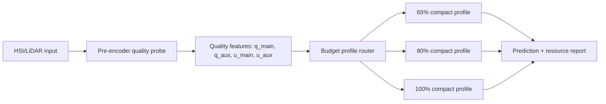

# BRM-Net 质量条件预算路由推进记录

日期：2026-07-15

## 当前方向

当前论文主线从“固定预算下的结构化轻量化 + 缺失/退化模态鲁棒融合”进一步升级为“质量条件预算路由”。核心动机是：原有 MQE/RGF 主要在特征提取后调节融合权重，不能改变编码器已经消耗的计算量；新的方向把低成本预编码质量探针放到昂贵编码器之前，用质量与不确定性决定使用 65%/80%/100% 的可部署分支档位。

这条线的论文价值在于把三个问题合并为一个可实验验证的系统：模态质量估计、资源受限推理、缺失/退化模态鲁棒性。

## 已完成代码闭环

1. 预编码质量探针已接入 BRM-Net，并通过 `--lambda-pre-quality` 开关启用。
2. 质量探针输出 `pre_q_main`、`pre_q_aux`、`pre_u_main`、`pre_u_aux`，并进入训练/验证/测试指标。
3. 新增 `QualityBudgetRouter`、oracle profile target 与 routing loss，用于从质量特征映射到固定预算档位。
4. 新增 routing profile 实验矩阵生成能力，可生成 65%/80%/100% 三个档位的训练命令。
5. 新增 `scripts/evaluate_budget_profile_routing.py`，可把多个 compact profile 的指标合并为 oracle 路由报告。
6. 修正 compact metrics 资源占比为 0 的问题：脚本会从同目录 `resource_stats.json` 回填真实 MACs/Params ratio。

## 当前 pilot 实验

数据集：HSLiNets Houston2013 HS-LiDAR legacy patches
设置：official split, seed 0, 3 epochs, `lambda_pre_quality=0.5`, `aux_quality_degradation_prob=0.25`, `noise/downsample_4/occlusion_50`, `modality_dropout_prob=0.25`

已完成三个固定 profile：

| Target budget | Source validation OA | Source expected MACs | Compact MACs |
|---:|---:|---:|---:|
| 65% | 0.7562 | 0.6542 | 0.6488 |
| 80% | 0.7668 | 0.8018 | 0.7987 |
| 100% | 0.8127 | 1.0000 | 1.0000 |

这些结果是短训练 pilot，只能说明流程可运行、预算可命中、报告可生成，不能作为最终论文精度结论。

## Oracle 路由报告

生成文件：

- `docs/generated/brmnet_routing_profile_oracle_seed0.json`
- `docs/generated/brmnet_routing_profile_oracle_seed0.csv`

摘要：

| Metric | Value |
|---|---:|
| Evaluated states | 11 |
| Mean selected budget | 0.7727 |
| Mean expected MACs ratio | 0.7361 |
| Mean compact OA | 0.4137 |

解释：

- 多数退化辅助模态状态被 oracle 规则分到 80% profile。
- `aux_only` 与 `main_only` 被分到 65% profile，说明路由规则会在信息不足时选择较低预算。
- 当前 compact OA 偏低，主要因为 profile 只训练 3 epochs 且 compact fine-tune 为 0；该结果不应进入最终论文主表。
- 当前最重要的结论不是“性能已经达标”，而是质量探针、profile 训练、compact 导出、资源回填和路由评估已形成可复现实验管线。

## 下一步优先级

1. 把三个 profile 改为正式训练设置：至少 20 epochs，seed 0/1/2，保留 compact fine-tune 或等价校验。
2. 先固定 Houston2013，形成 profile 路由表：static 65/80/100、oracle routing、learned routing。
3. 训练 learned router：用 oracle labels 或验证集最优 profile labels 监督，报告选择准确率、平均 MACs、平均 OA。
4. 增加 calibration 图：质量分数/不确定性与 profile 选择、退化强度、OA drop 的关系。
5. 在 Houston 结果稳定后扩展 Trento 和 MUUFL，避免过早扩大数据集导致主线失控。

## 论文写法建议

方法章节应把贡献组织为：

1. Degradation-aware compact multimodal backbone：已有的 hard-concrete gate、compact export、availability mask 和 degradation supervision。
2. Pre-encoder modality quality probing：在编码前估计质量和不确定性，服务于资源分配而不是只做可视化诊断。
3. Quality-conditioned budget profile routing：在多个可部署 compact profile 之间选择，实现按输入状态改变推理成本。

实验章节应把当前 pilot 作为“routing pipeline validation”，正式结果需要重新运行长训练后再进入主表。

## Formal Seed0 更新

已完成 Houston2013 seed0 的 65%/80%/100% 三个正式 profile：

- 训练轮数：20 epochs
- compact fine-tune：3 epochs
- 质量探针：`lambda_pre_quality=0.5`
- 退化增强：`noise,downsample_4,occlusion_50`
- 训练时 modality dropout：0.25

生成文件：

- `docs/generated/brmnet_routing_profile_formal_matrix.csv`
- `docs/generated/run_brmnet_routing_profiles_formal.ps1`
- `docs/generated/brmnet_routing_profile_formal_oracle_seed0.json`
- `docs/generated/brmnet_routing_profile_formal_oracle_seed0.csv`
- `docs/generated/brmnet_routing_profile_formal_comparison_seed0.json`
- `docs/generated/brmnet_routing_profile_formal_comparison_seed0.csv`

seed0 汇总如下：

| Policy | Mean OA | Mean selected budget | Mean MACs ratio |
|---|---:|---:|---:|
| Static 65% | 0.7158 | 0.6500 | 0.6121 |
| Static 80% | 0.7231 | 0.8000 | 0.7572 |
| Static 100% | 0.7461 | 1.0000 | 0.9420 |
| Oracle routing | 0.7501 | 0.9182 | 0.8835 |
| Learned routing | 0.7501 | 0.9182 | 0.8835 |

当前解释：

- 与 static 100% 相比，oracle/learned routing 在 seed0 上略高 0.0040 mean OA，同时平均 MACs 从 0.9420 降到 0.8835。
- learned routing 当前是在同一组 mode-level oracle labels 上训练并评估，意义是验证路由器可拟合规则，不应写成泛化能力结论。
- 真正可写进论文主表的结果仍需 seed1/2，以及更严格的 learned router 划分策略，例如 leave-one-state-out 或 validation-label 训练。
