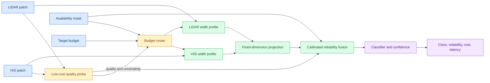
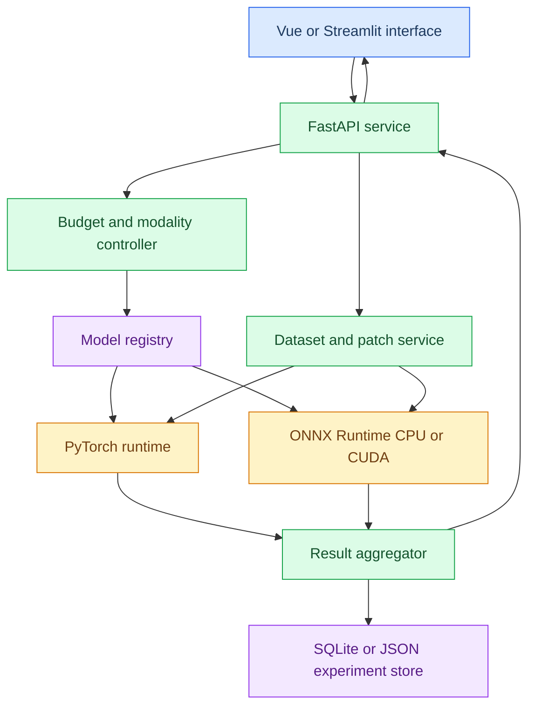
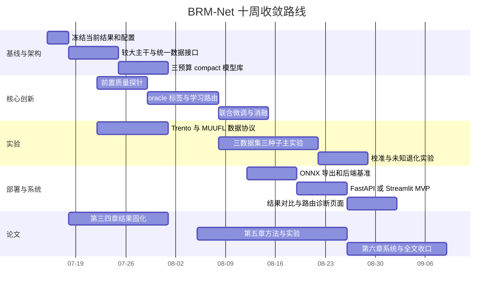

# BRM-Net 硕士论文创新扩展与演示系统规划

> 版本：2026-07-15  
> 适用工程：`D:\Academic\current\Bad`，分支 `brmnet-core-extraction`  
> 目标：在保留现有可验证成果的前提下，把项目从“轻量化模块 + 鲁棒性实验”升级为具有统一科学问题、充分实验量和工程闭环的硕士毕业项目。

## 1. 结论先行

当前项目已经不是“需要重新开始”的状态。它具备真实数据协议、结构化预算学习、compact 导出、缺失/退化模态训练、三种子实验和论文生成链路，这些资产应全部保留。但以当前形态直接作为硕士论文终稿，仍有四个明显风险：

| 风险 | 当前表现 | 风险等级 |
|---|---|---:|
| 方法耦合不足 | 预算门控和可靠性融合基本是并联相加，质量没有真正决定计算分配 | 高 |
| 模型与数据规模不足 | 约 0.47M 参数的小模型、主要结果集中在 Houston2013 | 高 |
| 创新边界不够突出 | Hard-Concrete、质量加权、模态 dropout 单独看都有成熟先例 | 高 |
| 部署证据不足 | 已有 PyTorch 延迟和 compact 权重，但缺 ONNX/FP16/INT8 与系统闭环 | 中高 |

最推荐的升级不是继续堆叠 DrFuse、生成式补全或完整 MoE，而是形成下面这一条统一主线：

> **面向计算预算变化与模态质量不稳定的多模态遥感分类，研究如何在样本级估计模态可靠性，并据此选择可实际部署的分支宽度和融合策略，在满足资源约束的同时提高退化及缺失模态下的鲁棒性。**

论文可保留三个递进贡献：

1. 预算感知结构化通道学习与真实 compact 导出，即现有 BCG/Hard-Concrete 主线。
2. 面向缺失与多类型退化的可靠性监督和 availability-conditioned fusion，即现有 MQE/RGF 主线。
3. 新增**质量条件预算路由**：用低成本质量探针在深层计算前选择分支宽度组合，使“模态可靠性”真正参与“计算资源分配”。

其中第 3 点是下一阶段最值得投入的核心创新；多数据集、较大主干和部署系统负责把该创新变成可信的硕士工作量和证据链。

## 2. 当前项目能够保留的成果

### 2.1 已有方法资产

| 资产 | 代码位置 | 当前价值 | 后续处理 |
|---|---|---|---|
| Hard-Concrete 通道门控 | `brmnet_core/hard_concrete.py`、`gated_blocks.py` | 可学习离散结构 | 保留为静态预算学习基础 |
| 真实 Params/MACs 预算 | `brmnet_core/resources.py` | 比门控均值更可解释 | 扩展到分支级预算表 |
| Compact 模型导出 | `brmnet_core/export.py`、`compact.py` | 形成实际稠密模型 | 作为动态配置库的导出器 |
| 可用性掩码与模态 dropout | `brmnet_core/availability.py`、`engine.py` | 支持缺失模态闭环 | 保留并补概率分布实验 |
| 退化质量监督 | `brmnet_core/engine.py` | 已覆盖噪声、遮挡、降采样 | 增加连续强度与未知退化 |
| 可靠性融合 | `brmnet_core/fusion.py` | 已有正负对照证据 | 升级为可校准质量估计 |
| 实验与论文生成 | `scripts/`、`docs/generated/` | 可重复、多种子、可追溯 | 统一配置与结果数据库 |

截至本次审计，当前 clean 主线约有 43 个 Python 文件、7854 行代码和 129 个测试函数；`quality_multi_degradation_p025` 在约 80% MACs 下已经形成三种子结果。现有工作不是废稿，问题在于还缺少更高一层的统一机制和跨场景验证。

### 2.2 已有实验能够支持的结论

当前最稳健的结论是：

- Hard-Concrete + compact export 能较稳定地命中目标 MACs 预算；
- 单纯无监督可靠性权重并不必然优于均匀融合；
- 把退化但仍可用的辅助模态纳入质量监督后，高噪声、遮挡和降采样场景的平均性能明显改善；
- 轻量多类型退化日程 `p=0.25` 比 `p=0.50` 更好地平衡完整模态精度和不利状态鲁棒性。

这些结果适合支撑“为什么需要质量监督”，但还不足以证明“质量感知资源分配”。后者必须通过新模块和新消融建立。

## 3. 文献调研与创新边界

### 3.1 调研范围

本轮采用叙述性范围综述，检索日期为 2026-07-15，重点覆盖 2018-2026 年的四类工作：

- 多模态缺失与退化鲁棒学习；
- HSI-LiDAR 多源遥感分类与动态路由；
- slimmable、Once-for-All 和动态宽度网络；
- ONNX/TensorRT 边缘部署与量化。

纳入标准为：正式论文主页、会议开放论文、arXiv 原文、官方机构或官方软件文档；排除无法确认方法细节的二手介绍。该调研用于技术路线决策，不等同于最终论文的系统综述，正式 related work 仍需按学校格式补齐 BibTeX 和逐条核验。

### 3.2 对本项目最重要的外部进展

| 研究趋势 | 已有代表工作 | 对本项目的约束 |
|---|---|---|
| 缺失模态成为独立问题 | MLMM Survey 系统归纳了缺失模态的训练与测试设定[^1] | 论文可保留缺失模态，但必须明确缺失模式与训练假设 |
| 动态专家处理缺失模态 | SimMLM 用动态模态专家适配完整和部分模态[^2]；MaMOL 将遥感缺失模态重构为条件计算[^3] | “动态路由”本身已不新，必须突出硬件可部署、预算约束和退化质量 |
| HSI-LiDAR 动态交互 | DCMNet 在三套公开 HSI-LiDAR 数据上使用数据依赖路由[^4] | 仅做动态融合不足，需报告真实计算与缺失/退化状态 |
| 不确定性驱动融合 | EAU 显式建模单模态 aleatoric uncertainty[^5]；PML 用概率表征和可靠融合处理噪声[^6] | 当前 MQE 不能只输出不可校准分数，应增加 ECE/Brier/风险覆盖评价 |
| 动态宽度与一次训练多子网 | Slimmable、US-Net、OFA、DS-Net 证明了连续存储通道和运行时宽度选择的可行性[^7][^8][^9][^10] | 动态稀疏 mask 难转化为真实速度，宜采用有限个连续通道宽度配置 |
| 边缘推理需要真实后端证据 | ONNX Runtime 支持 CPU、CUDA、TensorRT 等 Execution Provider[^11]；TensorRT 官方流程为 ONNX 到不同精度 engine[^12] | Params/MACs 不能代替部署，至少补 ONNX Runtime CPU/CUDA 的实测 |

### 3.3 论文不能再声称什么

以下表述风险较高，应避免：

- “首次将动态路由用于 HSI-LiDAR 分类”；DCMNet 已有直接相关工作。
- “首次解决遥感缺失模态条件计算”；MaMOL 已直接采用这一视角。
- “质量分数天然可解释为可靠性”；当前实验已经显示分数和退化强度不总是单调。
- “完成星上部署”；除非获得真实星载或等价边缘硬件，只能称为资源约束模拟和边缘部署验证。

仍有希望形成的差异化定位是：

> 与追求复杂专家交互或缺失模态重建的方法不同，本文面向可部署约束，使用低成本质量探针选择有限个稠密宽度配置，并把缺失、退化、资源预算和真实运行时放在同一评价框架中。

## 4. 推荐的新方法：质量条件预算路由 BRM-Net

建议暂定名为 **QBR-BRMNet（Quality-conditioned Budget-Routed BRM-Net）**。名称可在论文定稿时再统一，当前先固定技术含义。

### 4.1 关键改变一：质量估计必须前移

当前 MQE 在编码器深层特征之后预测质量，因此它只能改变融合权重，无法节省此前已经发生的计算。新方法增加一个浅层质量探针：

\[
(q_h,q_l,u_h,u_l)=Q_\phi(x_h,x_l,a),
\]

其中 \(q\) 为模态质量，\(u\) 为不确定性，\(a\) 为模态可用性。探针可由每个模态两层 depthwise-separable convolution、全局池化和小型 MLP 组成，目标开销控制在完整模型 MACs 的 1%-3%。

质量探针监督来源包括：

- 已知缺失状态；
- 噪声、遮挡、降采样的连续强度标签；
- 单模态分支的预测损失或正确性，作为样本级效用软标签；
- 未知退化时的预测熵或能量分数，仅作为辅助信号，不直接等同于真实质量。

### 4.2 关键改变二：使用可部署的离散宽度配置

不建议直接做任意通道动态 mask。真实后端通常无法从不规则 mask 获得对应加速。建议每个分支只保留三个嵌套宽度：

\[
\mathcal{W}=\{0.65,0.80,1.00\},
\]

并通过现有 Hard-Concrete + compact exporter 先导出稠密子网。HSI 和 LiDAR 可独立选择宽度，但通过固定维度投影层映射到统一融合空间，解除当前 shared gate 对最终通道数的耦合。

第一版不必立即实现完整 slimmable supernet。可先训练/导出 3 个预算配置，形成 3×3 的分支组合模型库；路由机制成立后，再决定是否用 sandwich rule 和 inplace distillation 合并为共享权重超网。

### 4.3 关键改变三：预算与质量联合决策

路由器输入为质量、不确定性、availability 和用户预算：

\[
\pi_\theta(k_h,k_l\mid q_h,q_l,u_h,u_l,a,\rho),
\]

其中 \(k_h,k_l\) 是两分支宽度档位，\(\rho\) 是目标预算。优化目标可写为：

\[
\mathcal{L}=\mathcal{L}_{cls}
+\lambda_q\mathcal{L}_{quality}
+\lambda_{cal}\mathcal{L}_{calibration}
+\lambda_b[\max(0,C(k_h,k_l)-\rho)]^2
+\lambda_d\mathcal{L}_{distill}.
\]

为了降低端到端训练风险，推荐三阶段实现：

1. 分别训练并导出不同预算的静态子网。
2. 对训练集离线评估所有配置，构造“满足预测损失容差时成本最低”的 oracle 路由标签。
3. 训练轻量路由器模仿 oracle，最后用 Gumbel-Softmax 或策略蒸馏做小步联合微调。

这一设计有三个好处：路由监督可解释、失败时可退回静态模型、每个候选配置都能独立导出和计时。

### 4.4 关键改变四：可靠性从可视化分数升级为可校准证据

至少增加以下指标：

| 指标 | 作用 |
|---|---|
| ECE | 衡量置信度与正确率的一致性 |
| Brier score | 衡量概率预测整体质量 |
| NLL | 衡量概率分布拟合 |
| AUROC-A | 检测辅助模态是否严重退化 |
| Risk-Coverage / AURC | 系统拒识或回退时的风险 |
| 质量-强度 Spearman | 检查质量分数是否随退化强度单调变化 |

温度缩放可作为简单校准基线；若概率质量头收益不稳定，不必引入复杂 vMF 分布，只需把“不校准的权重”与“校准后的决策信号”清楚区分。

## 5. 工作量扩展的优先级

| 优先级 | 工作包 | 创新贡献 | 工作量贡献 | 难度 | 是否必须 |
|---:|---|---:|---:|---:|---|
| P0 | 较大双分支主干 + 统一数据接口 | 中 | 高 | 中 | 是 |
| P0 | 三预算稠密模型库与真实导出 | 中 | 高 | 中 | 是 |
| P0 | 质量条件预算路由 | 高 | 高 | 中高 | 是 |
| P0 | Houston、Trento、MUUFL 三数据集 | 中 | 高 | 中 | 是 |
| P0 | 三种子、完整/缺失/退化实验矩阵 | 中 | 高 | 中 | 是 |
| P1 | ONNX Runtime CPU/CUDA + FP16 | 低 | 高 | 中 | 是，至少 FP32/FP16 |
| P1 | 可靠性校准和拒识/回退 | 中高 | 中 | 中 | 推荐 |
| P1 | 可交互演示系统 | 低 | 高 | 中 | 是 |
| P2 | INT8 PTQ/QAT | 低中 | 中高 | 中高 | 选做 |
| P2 | 共享权重 slimmable supernet | 高 | 高 | 高 | 路由成立后再做 |
| P3 | 生成式模态补全、完整 MoE、Mamba 重构 | 不确定 | 很高 | 很高 | 不建议 |

这里的关键取舍是：**毕业工作量应通过完整问题链、严格实验和可复现系统体现，而不是用更多无法解释的模块体现。**

## 6. 实验设计

### 6.1 数据集和协议

最低配置建议使用三套同类任务数据：

| 数据集 | 模态 | 作用 | 注意事项 |
|---|---|---|---|
| Houston2013 | HSI + LiDAR/DSM | 与当前结果连续，主消融 | 保留 official split，随机划分只做敏感性分析 |
| Trento | HSI + LiDAR | 跨城市、跨传感器泛化 | 固定公开划分并记录坐标区域 |
| MUUFL Gulfport | HSI + LiDAR | 更复杂场景和类别分布 | 明确训练/测试掩码来源 |

Augsburg（HSI+SAR/DSM）可作为 P2 跨模态类型实验，但不应替代前三套 HSI-LiDAR 主实验，否则会增加数据预处理和结论解释成本。

每套数据至少运行 3 个种子。若 official split 唯一，则种子只控制初始化和训练随机性；不得把不同随机像素划分与初始化种子混为一类统计。

### 6.2 对比方法

主表不需要无限增加 SOTA，需覆盖以下科学问题：

| 组别 | 方法 |
|---|---|
| 单模态下界 | HSI-only、LiDAR-only |
| 朴素融合 | concat、uniform average |
| 鲁棒融合 | modality dropout、当前 RGF、退化监督 RGF |
| 静态轻量化 | dense、65%、80%、90% compact |
| 动态预算 | 固定预算、启发式质量路由、学习路由、oracle 路由 |
| 相关方法 | 选择 2-4 个可复现或同协议报告的 HSI-LiDAR 方法，如 MIViT、DCMNet |

相关论文若无法获得相同数据划分和代码，只能放入“published result”区，不得与重跑结果混成同一统计结论。

### 6.3 退化与缺失矩阵

对每个辅助模态构造：

- 缺失：HSI-only、LiDAR-only；
- 高斯噪声：至少 5 个强度；
- 遮挡：10%、25%、50%、75%；
- 空间分辨率损失：2×、4×、8×；
- 混合退化：噪声 + 降采样、遮挡 + 噪声；
- 未见退化：训练中不出现的一种 blur、stripe 或随机坏点，用于测试泛化。

最终不只报告平均 OA，还需报告 adverse-state mean、worst-case OA 和 clean-to-adverse drop。

### 6.4 关键消融

1. 无质量探针 / 深层 MQE / 前置质量探针。
2. 均匀融合 / 未校准 RGF / 校准 RGF。
3. 固定 80% / 启发式路由 / 学习路由 / oracle 上界。
4. 联合预算路由中去掉 \(q\)、\(u\)、availability、\(\rho\) 的影响。
5. 独立分支宽度与共享宽度的比较。
6. 无蒸馏 / logits 蒸馏 / feature 蒸馏。
7. PyTorch compact / ONNX FP32 / ONNX FP16 / INT8（若完成）。

### 6.5 必须形成的图表

| 图表 | 回答的问题 |
|---|---|
| Accuracy-Efficiency-Robustness 三维 Pareto 图 | 方法是否同时改善三目标 |
| 预算命中误差图 | 实际 MACs/延迟是否符合目标预算 |
| 质量-退化强度校准曲线 | 质量估计是否可信 |
| 路由热力图 | 不同质量和预算下选择了什么宽度 |
| 分类图与错误差分图 | 改进发生在空间上的什么区域 |
| 每类 F1/AA 雷达或点图 | 是否只改善多数类 |
| latency breakdown | 质量探针、编码器、融合、后处理各占多少时间 |

## 7. 演示系统设计

系统定位应是“算法与部署约束验证平台”，而不是虚构的卫星业务系统。它不负责在线训练，主要展示同一输入在不同模态状态、预算和推理后端下的结果变化。

### 7.1 系统架构

### 7.2 最小功能页面

| 页面 | 必须功能 | 答辩价值 |
|---|---|---|
| 数据浏览 | 选择数据集、区域、HSI 波段合成、LiDAR 高程、标签 | 证明数据链路完整 |
| 推理控制台 | 模态开关、退化类型/强度、预算、后端、精度 | 直接展示核心研究变量 |
| 结果对比 | 分类图、置信度图、错误图、OA/AA/Kappa/F1 | 直观看鲁棒性收益 |
| 路由诊断 | q、u、融合权重、分支宽度、MACs、延迟 | 展示方法不是黑盒 |
| 实验档案 | 配置、模型哈希、时间、指标、导出报告 | 体现工程可追溯性 |

### 7.3 推荐技术栈与取舍

最快可完成的 MVP 是 `Streamlit + Plotly + brmnet_core service layer`，3-5 天可形成可演示版本。但为了让论文系统章节具备清晰 B/S 架构，推荐最终形态为：

- 后端：FastAPI、Pydantic、PyTorch、ONNX Runtime；
- 前端：Vue 3 + Vite + ECharts，地图需求不高时无需引入复杂 GIS 服务；
- 存储：SQLite 保存任务与指标，模型和栅格结果使用文件系统；
- 部署：Windows 本机启动脚本，选做 Docker；
- 报告：导出 JSON、CSV 和单次推理 PDF/HTML 报告。

不要在第一版加入用户管理、云端训练、复杂数据库或实时卫星数据接入，这些不会增强核心论文证据。

### 7.4 后端接口

| 接口 | 输入 | 输出 |
|---|---|---|
| `GET /datasets` | 无 | 数据集、模态、区域列表 |
| `GET /models` | 数据集、预算、后端 | 可用模型与资源信息 |
| `POST /infer` | 区域、模态状态、退化、预算、后端 | task id |
| `GET /tasks/{id}` | task id | 状态、指标、图层路径 |
| `GET /tasks/{id}/diagnostics` | task id | 质量、权重、路由、延迟分解 |
| `POST /compare` | 两个或多个 task id | 差分指标与对比图 |

### 7.5 四个答辩演示脚本

1. **预算切换**：同一区域从 100% 切到 80% 和 65%，展示分类图、MACs 和实测延迟变化。
2. **模态退化**：逐步增加 LiDAR 遮挡或噪声，展示质量、融合权重和路由宽度变化。
3. **模态缺失回退**：关闭 LiDAR，系统自动切到 HSI-only 可部署配置，并显示性能预期。
4. **后端对比**：同一 compact 模型在 PyTorch、ONNX CPU/CUDA 或 FP16 上运行，展示输出一致性和延迟。

演示必须使用预热后的中位数/P95 延迟，并同时显示设备、batch size、输入尺寸和重复次数，避免把不可复现的单次计时作为部署结论。

## 8. 论文结构建议

| 章节 | 内容 | 主要证据 |
|---|---|---|
| 第 1 章 | 场景、问题、研究内容 | 资源受限与模态不稳定的联合动机 |
| 第 2 章 | 多模态融合、缺失模态、结构化轻量化、动态网络 | 文献分类和研究缺口 |
| 第 3 章 | 预算感知结构化 BRM-Net | 预算命中、compact 等价、静态 Pareto |
| 第 4 章 | 退化校准可靠性融合 | 缺失/退化矩阵、校准与消融 |
| 第 5 章 | 质量条件预算路由统一框架 | 动态路由、oracle 对比、多数据集 AER Pareto |
| 第 6 章 | 多预算多模态验证系统 | 需求、架构、实现、功能与部署测试 |
| 第 7 章 | 总结与展望 | 结论边界和真实硬件局限 |

第三、四章不是为了凑成两个独立算法，而是第五章统一机制的两项基础能力。第五章必须有新实验，不能只是把前两章结果放在同一张表里。

## 9. 连续推进计划

### 9.1 前 72 小时

1. 冻结当前 Houston 结果清单，补齐 source/compact、配置和模型哈希。
2. 为 `brmnet_core` 增加 backbone 接口，先实现一个 1-2M 参数的残差双分支版本，不直接复用旧文件中的大量耦合类。
3. 把最终融合通道改为分支独立 projection，使两个分支可使用不同宽度。
4. 给 Trento 和 MUUFL 建立 dataset manifest 与 smoke test，先不跑长实验。
5. 写出质量探针的输入、监督标签、损失和开销单元测试。

### 9.2 两周验收点

两周后必须回答：

- 大主干 dense/full OA 是否不低于当前小模型，且参数/MACs 有足够压缩空间？
- 65/80/100 三档是否都能导出并命中预算误差 ±2%？
- 前置质量探针能否在已知退化上达到可用的 AUROC 和单调相关性？
- 两个新数据集是否已完成固定划分的单次运行？

若任一问题未完成，不进入 slimmable supernet 和前端开发。

### 9.3 四周验收点

学习路由至少应满足：

- 在相同平均 MACs 下，adverse-state mean OA 高于最佳固定预算模型；或
- 在 OA 下降不超过预设阈值时，平均实测延迟低于固定模型；
- 路由性能明显高于随机路由和简单阈值启发式，并接近 oracle 上界。

如果学习路由连续两轮设计仍无法超过启发式路由，则将“学习路由”降级为分析实验，论文主贡献改为“校准质量驱动的可解释预算策略”，不要无止境调参。

## 10. 风险控制与最低毕业版本

| 风险 | 预警信号 | 止损方案 |
|---|---|---|
| 大主干不收敛 | dense OA 明显低于小模型 | 使用现有 Couple_CNN 的规范化重写版，不迁移全部旧代码 |
| 独立分支宽度破坏融合 | compact 输出维度不一致 | 固定 64/128 维 projection，再做融合 |
| 动态路由无收益 | 不优于固定 80% 或启发式 | 保留 oracle 分析，转为静态场景策略 |
| 多数据集协议混乱 | 无公开 split 或复现不一致 | 每套数据建立 manifest、mask 哈希和协议说明 |
| ONNX 不支持某算子 | 导出失败或数值不一致 | 只导出 compact 稠密模型，路由器和子网分开导出 |
| INT8 精度大幅下降 | OA 下降超过 1-2 pp | 保留 FP16 为部署主结果，INT8 作为负结果/附录 |
| 系统占用过多时间 | 算法主表未完成就开发 UI | 先做 Streamlit MVP，主表完成后再分离前后端 |

最低可接受毕业版本应包含：

- 一个统一而非堆叠的框架；
- 三套数据、三种子、固定协议；
- 静态预算 + 退化可靠性 + 至少一种质量驱动预算策略；
- compact 模型和 ONNX 实测；
- 可演示的模态开关、预算切换、退化注入和诊断页面；
- 完整消融、失败案例和结论边界。

## 11. 最终判断

该项目可以继续作为硕士毕业依靠，但条件是立即从“继续丰富当前小模型”转向“统一科学问题 + 较大主干 + 多数据集 + 真实部署”的证据建设。

最重要的取舍是：

> 保留当前 BRM-Net 作为已经完成的机制基础，不推倒重来；新增前置质量探针和可部署离散预算路由，让可靠性真正决定计算；用多数据集、三种子、校准、真实延迟和演示系统把贡献闭环。

若时间只能完成一项新方法工作，应优先完成“质量条件预算路由”，而不是生成式补全、Mamba、完整 MoE 或更复杂的图网络。它与现有代码复用度最高，也最能回答导师可能追问的两个问题：为什么轻量化和模态鲁棒性必须放在一起，以及这种联合设计是否产生了可测量的收益。

## 参考资料

[^1]: Wu, R. et al. *Deep Multimodal Learning with Missing Modality: A Survey*. arXiv:2409.07825. https://arxiv.org/abs/2409.07825
[^2]: Li, S. et al. *SimMLM: A Simple Framework for Multi-modal Learning with Missing Modality*. ICCV 2025. https://openaccess.thecvf.com/content/ICCV2025/papers/Li_SimMLM_A_Simple_Framework_for_Multi-modal_Learning_with_Missing_Modality_ICCV_2025_paper.pdf
[^3]: Gao, Q. et al. *Rethinking Efficient Mixture-of-Experts for Remote Sensing Modality-Missing Classification*. arXiv:2511.11460. https://arxiv.org/abs/2511.11460
[^4]: Lin, J. et al. *Dynamic Cross-Modal Feature Interaction Network for Hyperspectral and LiDAR Data Classification*. arXiv:2503.06945. https://arxiv.org/abs/2503.06945
[^5]: Gao, Z. et al. *Embracing Unimodal Aleatoric Uncertainty for Robust Multimodal Fusion*. CVPR 2024. https://openaccess.thecvf.com/content/CVPR2024/html/Gao_Embracing_Unimodal_Aleatoric_Uncertainty_for_Robust_Multimodal_Fusion_CVPR_2024_paper.html
[^6]: Hu, P. et al. *Probabilistic Multimodal Learning with von Mises-Fisher Distributions*. IJCAI 2025. https://www.ijcai.org/proceedings/2025/600
[^7]: Yu, J. et al. *Slimmable Neural Networks*. ICLR 2019. https://openreview.net/pdf?id=H1gMCsAqY7
[^8]: Yu, J., Huang, T. *Universally Slimmable Networks and Improved Training Techniques*. ICCV 2019. https://openaccess.thecvf.com/content_ICCV_2019/papers/Yu_Universally_Slimmable_Networks_and_Improved_Training_Techniques_ICCV_2019_paper.pdf
[^9]: Cai, H. et al. *Once-for-All: Train One Network and Specialize it for Efficient Deployment*. ICLR 2020. https://openreview.net/pdf?id=HylxE1HKwS
[^10]: Li, C. et al. *Dynamic Slimmable Network*. CVPR 2021. https://arxiv.org/abs/2103.13258
[^11]: ONNX Runtime. *Execution Providers*. https://onnxruntime.ai/docs/execution-providers/
[^12]: NVIDIA. *Example Deployment Using ONNX*. https://docs.nvidia.com/deeplearning/tensorrt/latest/getting-started/quick-start-onnx-deployment.html
